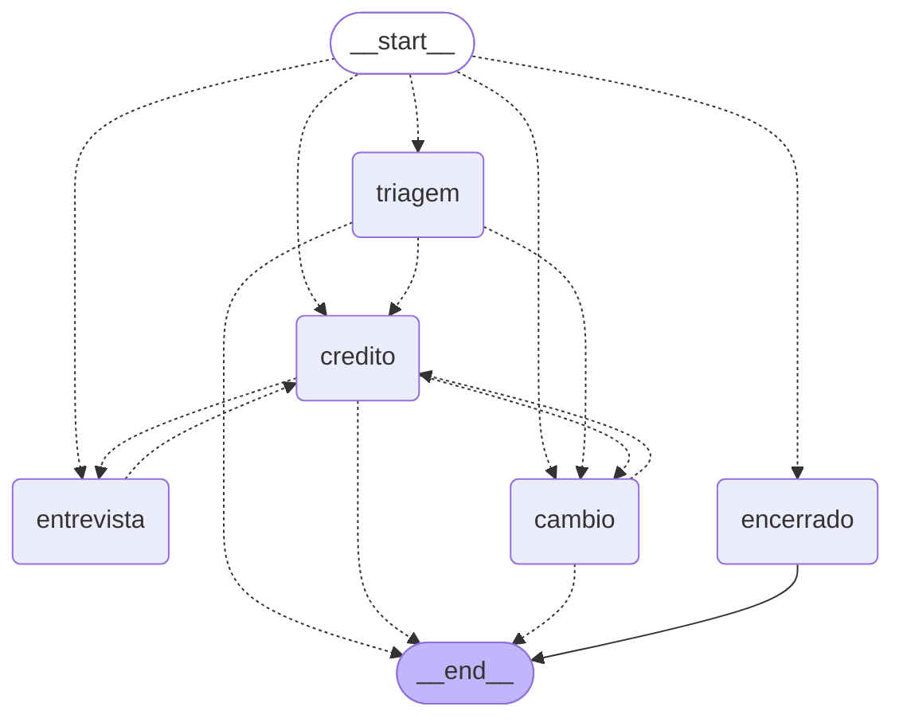
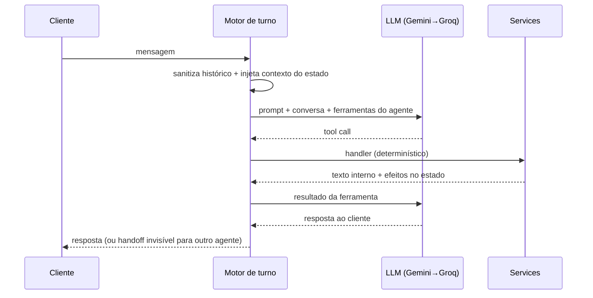

# AgilBot — Agente Bancário Inteligente

Atendimento ao cliente do **Banco Ágil** conduzido por **quatro agentes de IA
especializados**, orquestrados com **LangGraph**. Para o cliente existe **um único
atendente** com várias habilidades: as trocas de contexto entre agentes acontecem dentro
do mesmo turno e são invisíveis.

A interface é **Streamlit** e invoca o grafo **no mesmo processo** — não há camada HTTP
intermediária. O estado de cada atendimento vive no **checkpointer do LangGraph**,
persistido em **PostgreSQL**, que também hospeda os vetores da base de conhecimento
(**pgvector**).

---

## Sumário

- [Visão Geral](#visão-geral)
- [Arquitetura](#arquitetura)
  - [Estrutura de diretórios](#estrutura-de-diretórios)
  - [O grafo](#o-grafo)
  - [O ciclo de um turno](#o-ciclo-de-um-turno)
  - [Manipulação de dados](#manipulação-de-dados)
  - [Degradação controlada](#degradação-controlada)
- [Funcionalidades](#funcionalidades)
- [Desafios enfrentados e como foram resolvidos](#desafios-enfrentados-e-como-foram-resolvidos)
- [Escolhas técnicas e justificativas](#escolhas-técnicas-e-justificativas)
  - [Escolha do modelo e cotas](#escolha-do-modelo-e-cotas)
- [Tutorial de execução e testes](#tutorial-de-execução-e-testes)
- [Rastreabilidade dos requisitos](#rastreabilidade-dos-requisitos)

---

## Visão Geral

O atendimento começa na **Triagem**, que autentica o cliente com CPF e data de nascimento
contra `clientes.csv` e só depois direciona ao contexto adequado.

| Agente | Responsabilidade |
| --- | --- |
| **Triagem** | Saudação, validação de CPF, autenticação (até 3 tentativas) e roteamento. |
| **Crédito** | Consulta de limite e solicitação de aumento, com registro formal e análise por score. |
| **Entrevista de Crédito** | Entrevista financeira que recalcula e persiste o score. |
| **Câmbio** | Cotação de moedas em tempo real (AwesomeAPI). |

Os agentes de crédito e câmbio também consultam uma **base de conhecimento (RAG)** com as
políticas oficiais do banco, quando ela está disponível.

---

## Arquitetura

```
Streamlit (UI)  ──invoke(thread_id)──▶  LangGraph
                                          │
                    ┌─────────────────────┼─────────────────────┐
                 agents/              services/             providers/
            triagem·credito·        auth·credito·        llm (Gemini→Groq)
            entrevista·cambio       entrevista·cambio·   embeddings
                                    knowledge·scoring    vectorstore·checkpointer
                                          │                      │
                                   repositories/ ──▶ CSVs   PostgreSQL + pgvector
                                                          (checkpoints e vetores)
```

As dependências correm em uma direção só — `agents → services → repositories → domain` —
com `core` transversal e `providers` isolando todo o mundo externo. Nenhuma regra de
negócio conhece o LLM, e nenhum agente conhece o formato dos CSVs.

### Estrutura de diretórios

```
app/
  ui/            Streamlit: entrypoint, sessão, estilos e componentes
  src/
    core/          config, constants, logging, utils        (infra transversal)
    domain/        models, enums, results (Pydantic)        (puro, sem I/O)
    repositories/  acesso aos CSVs, com lock e escrita atômica
    services/      regras de negócio: auth, credito, entrevista, cambio, knowledge, scoring
    providers/     adaptadores externos: llm, embeddings, vectorstore, checkpointer
    rag/           documentos .md, loader e ingestão idempotente
    agents/        os 4 agentes: prompts, ferramentas, handlers e o motor de turno
    orchestration/ estado, grafo e container de injeção de dependência
  data/          CSVs (fonte de dados e artefatos gerados em runtime)
scripts/         spike vertical (conversa pelo terminal)
tests/           suíte completa, sem nenhuma chamada externa
infra/           Dockerfile, docker-compose, init do pgvector
```

### O grafo

Um nó por agente e uma **entrada condicional** que retoma sempre o `current_agent` — ou
desvia para o nó `encerrado` quando o atendimento já terminou. As arestas entre agentes
não são escritas à mão: cada nó devolve `Command(goto=...)` e a anotação de retorno
`Command[Literal[...]]` declara os destinos, de onde o LangGraph infere o grafo. Este
diagrama é gerado por `build_graph().get_graph().draw_mermaid()`.



O nó **`encerrado`** é a barreira de encerramento no domínio: ele responde sem chamar o
LLM e vai direto para `END`. Sem ele, `finished` seria apenas o `disabled` do campo de
chat, e qualquer caminho fora da UI — refresh, outra aba, sessão retomada do Postgres —
executaria operações normalmente sobre um atendimento já encerrado.

### O ciclo de um turno

O princípio que sustenta o desenho é **o estado é a memória; as mensagens são a
conversa**.

1. O motor monta o prompt do agente e anexa um **bloco de contexto renderizado a partir
   do estado** (CPF informado, cliente autenticado, limite, score, tentativas restantes,
   último pedido).
2. O histórico enviado ao LLM é **sanitizado**: só sobrevivem as mensagens do cliente e
   as falas do atendente. `tool_calls` e `ToolMessage` de turnos anteriores são
   descartados.
3. O modelo escolhe ferramentas; cada uma é executada por um **handler** determinístico
   sobre `services/`, que devolve texto ao modelo **e** efeitos no estado.
4. Se houve **handoff**, o turno termina ali e o texto do agente de origem é descartado —
   quem fala com o cliente é sempre o agente de destino.
5. Se o turno terminaria sem resposta, o motor **força uma redação final** sem
   ferramentas, ainda com os resultados das ferramentas à vista.



### Manipulação de dados

| Arquivo | Papel |
| --- | --- |
| `app/data/clientes.csv` | Base de autenticação. O `score` é reescrito após a entrevista e o `limite_atual` após um aumento aprovado. |
| `app/data/score_limite.csv` | Política de crédito por faixa: `score_min, score_max, limite_maximo, taxa_juros_mensal`. |
| `app/data/solicitacoes_aumento_limite.csv` | Gerado em runtime, com **exatamente as 5 colunas do enunciado**. |
| `app/data/historico_score.csv` | Gerado em runtime. Trilha de auditoria das mudanças de score: `cpf_cliente, data_hora, score_anterior, score_novo, origem`. |
| PostgreSQL | Checkpoints das sessões (LangGraph) e vetores da base de conhecimento (pgvector). |

**Ciclo de vida de uma solicitação.** O pedido é gravado como `pendente` **antes** de
qualquer julgamento; o score é então conferido contra a política e a **mesma linha**
transiciona para `aprovado` ou `rejeitado`. Uma reavaliação após a entrevista **não**
reescreve o pedido rejeitado: gera uma linha nova. Mutar `rejeitado → aprovado` apagaria
justamente a história que o arquivo existe para registrar — o avaliador consegue ler o
percurso inteiro com um `cat`.

Como o arquivo tem só as 5 colunas exigidas, não há chave primária: a identidade de um
pedido é o **índice da linha devolvido no append**, e o timestamp ISO 8601 carrega
microssegundos para que dois pedidos no mesmo segundo não se confundam.

**Por que existe um `historico_score.csv`.** Manter as 5 colunas do enunciado tem um
custo: nenhuma delas é score. Como `clientes.csv` guarda apenas o score vigente e é
sobrescrito a cada entrevista, o score **sob o qual cada decisão de crédito foi tomada**
não sobreviveria em nenhum dado consultável. O arquivo de histórico fecha isso sem tocar
no CSV que o enunciado especifica: os dois usam ISO 8601 com microssegundos, então cruzar
por timestamp reconstrói a decisão inteira — pedido rejeitado sob score 380, recálculo
para 505, pedido idêntico aprovado. Há um teste que assevera exatamente essa
reconstrução.

Gravar a trilha nunca invalida a operação que ela documenta: uma falha ao escrever o
histórico vira `warning` no log e o score permanece atualizado.

**Escrita.** Todo CSV é reescrito de forma atômica (arquivo temporário no mesmo
diretório + `fsync` + `os.replace`), preservando a permissão original.

A serialização entre threads depende de duas condições que são fáceis de perder de vista,
e por isso estão fixadas em teste (`tests/test_concorrencia.py`):

1. **Um repositório por arquivo.** O `threading.Lock` vive no objeto. Instanciar um
   `ClienteRepository` por serviço criaria três locks para o mesmo `clientes.csv`, que não
   serializam nada entre si — o container compartilha uma única instância.
2. **O ciclo read-modify-write inteiro sob o lock.** Ler fora e escrever dentro deixa a
   janela em que duas threads leem o mesmo estado e a segunda apaga a primeira. Toda
   alteração passa por `CsvRepository.mutate()`; ninguém usa `read_dicts` + `write_dicts`
   para mutar.

Aprovações de aumento usam ainda um **compare-and-set**: o novo limite só é gravado se o
valor em disco continuar sendo o que foi avaliado. Se outra operação escreveu no meio, a
gravação é recusada e registrada, em vez de sobrescrever cegamente.

**Limitação declarada:** isso é sincronização **intraprocesso**. Basta para a UI Streamlit,
que roda em processo único, e não cobre múltiplos workers ou containers gravando no mesmo
volume — nesse cenário, a persistência precisaria sair do CSV para um banco relacional.

### Degradação controlada

As falhas previsíveis são contidas na camada onde ocorrem e viram mensagem ao cliente, não
exceção. Isso vale para os caminhos abaixo e para o ponto mais provável de regressão — uma
exceção inesperada dentro de um handler de ferramenta é capturada pelo motor de turno, que
segue com uma resposta coerente e registra o erro no log.

| Componente | Situação | Comportamento |
| --- | --- | --- |
| LLM | Cota do Gemini esgotada | Fallback automático para o Groq |
| LLM | Nenhum provedor disponível | Mensagem de instabilidade, atendimento segue de pé |
| Sessões | Sem `POSTGRES_URL` ou banco fora | `MemorySaver` (sessão dura o processo) |
| RAG | Sem `GOOGLE_API_KEY` ou sem Postgres | Ferramenta não é registrada no `bind_tools` |
| Câmbio | API fora do ar ou timeout | Informa indisponibilidade; nunca inventa cotação |
| CSVs | Arquivo ausente ou linha corrompida | Erro controlado; linhas válidas seguem utilizáveis |

---

## Funcionalidades

- **Validação de CPF por dígitos verificadores** antes de pedir a data — um erro de
  digitação **não consome tentativa de autenticação**.
- **Autenticação** com CPF normalizado, **datas em formato livre** (`14/05/1990`,
  `14 05 1990`, `14 de maio de 1990`, `14051990`) e checagem de conta ativa. **Até 3
  tentativas**, com encerramento cordial na terceira — guarda imposta no handler, não no
  prompt.
- **Consulta de limite** com score, teto da faixa e taxa de juros aplicável.
- **Solicitação de aumento**: pedido registrado como `pendente`, avaliado contra a
  política e transicionado para `aprovado`/`rejeitado`; aprovação persiste o novo limite.
- **Oferta de entrevista** quando o pedido é rejeitado e **reavaliação automática** do
  pedido depois que o score muda — decidida no nó, sem depender do modelo.
- **Entrevista de crédito** com os 5 dados do enunciado, validados por Pydantic: um campo
  incompreensível volta ao modelo pelo nome, e só ele é reperguntado.
- **Valores como o cliente fala**: `4200`, `R$ 4.200`, `4.200,50`, `10 mil`, `10k`,
  `1,5 milhão`. A conversão é determinística, no código — inclusive no pedido de aumento,
  onde o handler reinterpreta o valor em vez de confiar que o modelo converteu certo.
- **Cotação de 10 moedas** (USD, EUR, GBP, ARS, JPY, CHF, CAD, AUD, CNY, BTC), declaradas
  como `Literal` no schema da ferramenta.
- **Base de conhecimento (RAG)** sobre políticas, tarifas, câmbio e segurança/LGPD.
- **Handoffs invisíveis**, com guarda de vazamento em runtime e no CI.
- **Encerramento por ferramenta** a qualquer momento, com barreira **no grafo**: uma
  mensagem que chegue depois do encerramento é respondida por um nó determinístico e
  não executa operação nenhuma — a garantia não depende do widget da UI.
- **Logs correlacionados por sessão**, para investigar um atendimento específico.

---

## Desafios enfrentados e como foram resolvidos

### 1. A fórmula de score do enunciado não alcança 0–1000

Os pesos fora o termo de renda somam no máximo **500** (formal 300 + 0 dependentes 100 +
sem dívidas 100). O termo `(renda / (despesas + 1)) × 30` só passa a dominar quando a
renda é cerca de **17× as despesas** — quando já satura o teto. Na prática, a faixa
alcançável é ~0–700, concentrada entre 450 e 600 para qualquer cliente empregado.

Isso quebraria a demonstração central. Semear scores em escala FICO (720, 850) faria a
entrevista **derrubar** o score de todo cliente, e o fluxo `rejeitado → entrevista →
aprovado` nunca fecharia.

**Solução:** as faixas de `score_limite.csv` e os scores semeados em `clientes.csv` foram
calibrados contra a escala real da fórmula, e um **teste de regressão** assevera que o
cliente do fluxo-vitrine sobe de score **e** muda de faixa. Um ajuste distraído em
qualquer dos dois CSVs quebra o teste, não a demo.

### 2. Histórico de tool calls atravessando handoffs

Quando a triagem passa o atendimento ao crédito, o nó de destino recebe o mesmo
`messages`, contendo `tool_calls` de ferramentas (`verificar_cpf`, `autenticar_cliente`)
que **não estão no `bind_tools` do agente de crédito**. Provedores com function calling
são estritos quanto a nomes não declarados e `tool_call_id` órfãos — e Gemini e Groq
divergem nessa validação, de modo que um thread que cai no fallback no meio precisa
produzir mensagens que **ambos** aceitem.

**Solução:** o histórico enviado ao LLM é **sanitizado** — só a conversa em linguagem
natural sobrevive; os pares de ferramenta permanecem apenas dentro do turno corrente,
onde o loop ReAct precisa deles. A classe inteira de erro deixa de existir, sem depender
da tolerância de cada provedor e sem enfraquecer o isolamento de escopo que o enunciado
exige.

### 3. A sanitização apagaria a memória entre turnos

Consequência direta da solução anterior: o CPF coletado no turno 1 vivia em um
`ToolMessage`, que passou a ser descartado. O agente pediria o CPF de novo logo depois de
o cliente informar a data.

**Solução:** `agents/contexto.py` reinjeta, a cada turno, um bloco derivado **do estado**
dentro do system prompt. O estado ganhou `cpf_informado` (pré-autenticação) separado de
`cpf` (pós), e o payload de handoff passou a viajar em `Command(update=...)` em vez das
mensagens. Um teste dedicado fixa o caso "CPF num turno, data no seguinte".

### 4. O estado inicial sobrescrevia o checkpoint a cada turno

A UI enviava `{**estado_inicial(), "messages": [...]}` em toda invocação. O checkpointer
restaurava a sessão corretamente e a entrada logo em seguida **zerava tudo** — o CPF do
turno anterior inclusive. Os testes do grafo não pegavam isso, porque ali o estado é
encadeado à mão.

**Solução:** enviar apenas o delta (`{"messages": [...]}`) e deixar o LangGraph fundi-lo
ao estado restaurado. Coberto agora por um teste que atravessa dois turnos pela camada de
sessão.

### 5. `os.replace` falharia no bind mount do Docker

A escrita atômica criava o arquivo temporário em `/tmp`, que no container vive no
overlayfs, enquanto `app/data` é um bind mount — outro filesystem. `os.replace` entre
filesystems levanta `OSError: [Errno 18] Invalid cross-device link`. Toda escrita de CSV
falharia **apenas dentro do Docker**, passando limpo em todos os testes locais.

**Solução:** o temporário nasce no **mesmo diretório do alvo**, com `fsync` antes da
troca e retry curto para a semântica de lock do Docker Desktop no Windows. Um teste fixa
o invariante do diretório.

### 6. Propriedade e permissão dos arquivos no host

Rodar o container como root deixaria os CSVs pertencendo ao root na máquina do avaliador;
fixar um UID arbitrário quebraria em máquinas com UID diferente. Além disso, `mkstemp`
cria arquivos com permissão `0600`, então a primeira escrita mudava silenciosamente a
permissão do CSV.

**Solução:** o UID/GID de quem sobe o compose é repassado como build arg, e a escrita
atômica preserva a permissão original do arquivo. Detalhe que só aparece na prática:
**`UID` é readonly no bash**, então a variável se chama `APP_UID` — `UID=$(id -u) docker
compose ...` falharia na linha de comando.

### 7. Reavaliação pós-entrevista não podia depender do modelo

Se o retorno ao crédito dependesse de o LLM lembrar de chamar `solicitar_aumento` de
novo, o desfecho do fluxo principal seria não-determinístico.

**Solução:** a reavaliação acontece **no nó**, antes da chamada ao LLM, com gatilho
explícito: o último pedido está `rejeitado` **e** o score do cliente difere do
`score_avaliado` guardado no estado. O modelo só comunica o resultado.

### 8. O modelo padrão tinha sido aposentado — e a resposta não era mais texto

O primeiro spike contra a API real falhou inteiro: `gemini-2.5-flash-lite` responde
**404 — "no longer available to new users"**. Chaves criadas recentemente simplesmente não
alcançam o modelo, embora ele ainda apareça na documentação. A degradação funcionou (todo
turno devolveu a mensagem de instabilidade em vez de quebrar), mas o atendimento não
existia.

Trocado o modelo, apareceu um segundo problema, mais sutil: o Gemini 3.x **não devolve
`content` como string**, e sim como lista de blocos tipados —
`[{"type": "text", "text": "Olá!", "extras": {...}}]`. Como o código tratava `content`
como texto, o cliente veria o `repr` de uma lista de dicionários na tela.

**Solução:** sondagem de modelos disponíveis com a chave em mãos (ver
[Escolha do modelo](#escolha-do-modelo-e-cotas)) e uma função única,
`core/utils.py::texto_da_mensagem`, que normaliza qualquer formato de `content` para
texto — usada pelo sanitizador, pela guarda de vazamento e pela UI. Coberta por testes com
blocos tipados.

### 9. O pool do Postgres bloqueava em vez de degradar

Com um `POSTGRES_URL` apontando para um banco inalcançável — ou para o Postgres de outro
projeto na mesma porta —, o `ConnectionPool` ficava tentando conectar indefinidamente. A
degradação para `MemorySaver`, que é justamente o ponto do provider, nunca acontecia: a
aplicação simplesmente travava ao subir.

**Solução:** `timeout` no pool e `connect_timeout` na conexão. O provider falha em 5
segundos e cai para memória, como projetado.

### 12. Escrita concorrente: o lock estava lá, a serialização não

Um passe adversarial mostrou que `clientes.csv` perdia atualizações em **30 de 30**
execuções com duas threads. O `threading.Lock` existia e estava correto — o que faltava
eram as duas condições para ele valer: o container criava um `ClienteRepository` por
serviço (três locks para o mesmo arquivo) e o `read-modify-write` lia fora do lock.

**Solução:** uma instância compartilhada no container, `CsvRepository.mutate()` com o
ciclo inteiro sob o lock, e **compare-and-set** na gravação do limite aprovado. Depois
disso, 0 de 30. Coberto por `tests/test_concorrencia.py` — a classe de cenário que
cobertura de linha não alcança, porque o defeito está no interleaving, não numa linha
não executada.

### 13. Três formas de derrubar a conversa que a suíte não via

Um valor de renda `inf` passava pelo `Field(ge=0)` (`inf >= 0` é verdadeiro) e estourava
em `OverflowError` no `int()` do score; uma vírgula sobrando em `clientes.csv` fazia o
`DictReader` criar a chave `None` e `Cliente(**linha)` levantar `TypeError`, derrubando a
autenticação de **todos**; e qualquer exceção não prevista dentro de um handler subia até
o grafo.

Os três tinham a mesma forma: exceção de um tipo que o `except` da camada não previa.
**Solução:** rejeitar não-finitos na fronteira (`parse_valor_monetario`), nomear o
`restkey` do `DictReader` para que o excedente nunca vire a chave `None`, ampliar os
`except` para o que de fato pode ocorrer, e envolver a chamada de handler no motor de
turno — o ponto de extensão mais provável do sistema.

### 14. Inconsistência do enunciado (`rejeitado` × `reprovado`)

O enunciado define a coluna com `rejeitado` e, mais adiante, fala em `reprovado` para o
mesmo estado. Padronizado no enum `StatusPedido`, usando o termo da definição das
colunas.

### 15. Dois drivers para o mesmo Postgres

O checkpointer do LangGraph fala **psycopg** (`postgresql://`) e o `PGEngine` do pgvector
é SQLAlchemy async, exigindo `postgresql+asyncpg://`. Manter duas variáveis de ambiente
seria um convite a configurá-las de forma inconsistente. A conversão acontece em um único
ponto (`providers/vectorstore.py`), e existe uma só `POSTGRES_URL`.

---

## Escolhas técnicas e justificativas

**LangGraph para orquestração.** O problema é, na essência, *fluxo de estado entre
agentes*, que é exatamente o que o LangGraph modela: cada agente é um nó, o estado
compartilhado é cidadão de primeira classe e o checkpointer dá persistência de sessão sem
código extra. O handoff invisível no mesmo turno cai naturalmente em `Command(goto=...)`.
CrewAI e AutoGen abstraem demais o controle de fluxo por turno; agentes ReAct do
LangChain dão menos controle determinístico sobre as transições; LlamaIndex brilha em RAG,
não em orquestração com estado.

**Ferramenta (schema) + handler (execução).** O `@tool` declara só o que o LLM enxerga; a
execução é determinística, isolada em `services/` e **testada sem chamar LLM**. O modelo
orquestra linguagem e escolhe ferramentas; ele nunca decide uma regra de negócio.
Acrescentar um agente é criar um módulo no mesmo formato e registrar um nó.

**Gemini primário → Groq como fallback.** Ambos com free tier. O Groq entra quando a cota
do Gemini estoura, com `max_retries=1` no primário para cair rápido. O modelo que atendeu
cada turno aparece no painel de diagnóstico, porque os modelos Llama são bem mais fracos
em roteamento multi-ferramenta e a queda de qualidade seria invisível.

#### Escolha do modelo e cotas

A documentação da Google não publica mais os limites por modelo (remete ao painel do AI
Studio), e os modelos citados na maioria dos tutoriais já não são acessíveis a chaves
novas. A escolha foi feita **sondando a API com a chave em mãos**, uma requisição por
modelo, exercitando uma tool call real:

| Modelo | Disponível | Tool calling | Latência |
| --- | --- | --- | --- |
| `gemini-2.5-flash-lite` | ✗ 404 (aposentado para chaves novas) | — | — |
| **`gemini-3.5-flash-lite`** | **✓** | **correta** | **0,78 s** |
| `gemini-3.1-flash-lite` | ✓ | correta | 0,79 s |
| `gemini-flash-lite-latest` | ✓ | correta | 0,65 s |
| `gemini-3.6-flash` | ✓ | correta | 1,56 s |
| `gemini-2.0-flash`, `2.0-flash-lite` | ✗ 429 | — | — |

Adotado **`gemini-3.5-flash-lite`**: a linha *flash-lite* é a de maior cota diária no free
tier e a mais rápida entre as testadas com tool calling correto. A versão é **fixada de
propósito** — `gemini-flash-lite-latest` é um alias móvel e mudaria o comportamento do
sistema sem nenhuma alteração no código.

**Quanto o atendimento consome.** Um turno do cliente custa **mais de uma requisição**:
cada rodada do loop ferramenta↔modelo é uma chamada, e a redação final pode ser outra. O
spike mede isso e imprime ao final — um atendimento completo de 12 turnos, atravessando os
quatro agentes, custou **21 requisições** (média 1,8 por turno, máximo 3).

O limite que aperta primeiro no free tier é o **de minuto**, não o diário: em uma conversa
fluida é fácil passar de 10 requisições por minuto. Por isso o spike aceita
`--pausa=<segundos>` entre turnos. Se ambos os provedores atingirem o limite, o atendente
responde com a mensagem de instabilidade — erro tratado, sem quebrar a aplicação.

**Streamlit invocando o grafo no mesmo processo.** O enunciado pede "uma UI simples para
testes". Uma API HTTP entre a UI e o grafo acrescentaria uma camada de serialização, um
serviço a subir e uma fonte de erro, sem entregar nada ao avaliador. O grafo *é* a API; o
checkpointer já é o estado da sessão.

**Um único Postgres para sessões e vetores.** Os checkpoints do LangGraph precisam de um
banco; o RAG precisa de um índice vetorial. Usar Postgres com pgvector para os dois deixa
o compose com **dois serviços** em vez de quatro, e dá SQL, backup e observabilidade
padrão sobre os vetores. Um banco vetorial embarcado evitaria o serviço, mas aqui o
Postgres já existe por outro motivo.

**Domínio em Pydantic.** Modelos, enums e resultados tipados. A normalização de linguagem
natural (`"PJ"` → autônomo, `"não tenho"` → `False`, `"R$ 4.200"` → `4200.0`) vive em
validadores testáveis, **nunca no prompt** — do contrário o comportamento dependeria do
modelo da vez.

**RAG como diferencial, não como requisito.** Não é pedido pelo enunciado. Está
implementado, mas atrás de uma flag que age no `bind_tools`: sem Postgres ou sem chave de
embeddings, o modelo sequer enxerga a ferramenta, em vez de chamá-la e receber vazio.

**Testes sem rede.** A suíte inteira roda com um LLM falso e a API de câmbio mockada.
Nenhuma chave é necessária no CI, e nenhum teste fica intermitente por causa de cota.

---

## Tutorial de execução e testes

Requer **Docker** (opção A) ou **Python 3.12** (opção B). As chaves ficam num `.env` na
raiz:

```bash
cp .env.example .env      # preencha GOOGLE_API_KEY e/ou GROQ_API_KEY
```

Uma chave já é suficiente. Com as duas, o Groq atua como fallback. A `GOOGLE_API_KEY`
também habilita o RAG (embeddings). **Sem nenhuma chave a aplicação sobe**, mas o
atendente responde com a mensagem de instabilidade.

### Opção A — Docker (recomendada)

Sobe dois serviços: `postgres` (com pgvector) e `app`.

```bash
make docker
# equivale a:
# APP_UID=$(id -u) APP_GID=$(id -g) docker compose -f infra/docker-compose.yml up --build
```

Interface em **http://localhost:8501**.

`APP_UID`/`APP_GID` fazem os CSVs escritos no bind mount pertencerem ao seu usuário. Se a
porta 5432 já estiver ocupada, suba com `POSTGRES_PORT=5433 make docker`.

Para indexar a base de conhecimento (opcional, exige `GOOGLE_API_KEY`):

```bash
docker compose -f infra/docker-compose.yml exec app python -m src.rag.ingest
```

### Opção B — Local, com uv

```bash
make install     # instala o Python 3.12 gerenciado e as dependências
make run         # http://localhost:8501
```

Sem `POSTGRES_URL`, as sessões ficam em memória e o RAG fica desligado — o restante do
atendimento funciona normalmente.

### Conversar pelo terminal (sem UI)

```bash
make spike          # roteiro automático que atravessa os 4 agentes
uv run python scripts/spike.py -i   # interativo
```

### Testes

```bash
make test    # suíte completa com cobertura
make lint    # ruff
```

A suíte cobre as regras determinísticas (CPF, datas, score, crédito, câmbio mockado,
repositórios) **e a orquestração completa** — grafo, handoffs, memória entre turnos e
sessões — com um LLM falso, **sem nenhuma chamada externa**. O mesmo conjunto roda no CI
(`.github/workflows/ci.yml`).

### Clientes de teste

| Cliente | CPF | Nascimento | Score | Limite | Demonstra |
| --- | --- | --- | --- | --- | --- |
| Ana Souza | 111.444.777-35 | 14/05/1990 | 540 | R$ 5.000 | Fluxo feliz: aumento aprovado |
| **Diego Rocha** | **222.555.888-46** | **19/07/1995** | **380** | **R$ 800** | **Rejeição → entrevista → aprovação** |
| Carla Mendes | 333.666.999-57 | 27/03/1978 | 655 | R$ 15.000 | Faixa de topo |
| Bruno Lima | 123.456.789-09 | 02/11/1985 | 280 | R$ 500 | Score baixo |
| Felipe Nunes | 987.654.321-00 | 08/09/1988 | 520 | R$ 10.000 | Conta bloqueada |

**Roteiro do fluxo-vitrine** (Diego): peça um aumento para **R$ 10.000** → é rejeitado
(teto de R$ 5.000 para score 380) e a entrevista é oferecida → aceite e responda renda
**4.200**, **autônomo**, despesas **1.200**, **0** dependentes, **sem** dívidas → o score
vai a **505**, o pedido é reavaliado sozinho e **aprovado**.

A história faz sentido porque o cadastro de Diego traz `renda_declarada` de R$ 2.600: a
entrevista revela que os dados estavam desatualizados, que é justamente o propósito desse
agente.

Depois, confira os artefatos no host:

```bash
cat app/data/solicitacoes_aumento_limite.csv   # rejeitado e, em nova linha, aprovado
cat app/data/historico_score.csv               # 380 -> 505, entre os dois pedidos
grep Diego app/data/clientes.csv               # score 505 e limite 10000
```

> **Cota de free tier.** Um atendimento completo custa cerca de **21 requisições ao LLM**
> (1,8 por turno em média) — ver [Escolha do modelo e cotas](#escolha-do-modelo-e-cotas).
> O limite que aperta primeiro é o de **requisições por minuto**. Ao esgotar, a aplicação
> cai para o Groq automaticamente; se ambos atingirem o limite, o atendente responde com
> uma mensagem de instabilidade — erro tratado, sem quebrar a aplicação. O modelo que
> atendeu cada turno aparece no painel **Diagnóstico**.

---

## Rastreabilidade dos requisitos

| Requisito do enunciado | Onde está | Teste |
| --- | --- | --- |
| Saudação, coleta de CPF e data | `agents/triagem.py`, `agents/prompts.py` | `test_graph.py::TestAutenticacao` |
| Autenticação contra `clientes.csv` | `services/auth_service.py` | `test_auth.py::TestAuthService` |
| Até 3 tentativas, encerramento cordial | `agents/triagem.py::_handler_autenticar` | `test_graph.py::test_tres_falhas_encerram_com_cordialidade` |
| Roteamento só após autenticar | `agents/triagem.py::_somente_autenticado` | `test_graph.py::test_direcionamento_bloqueado_sem_autenticacao` |
| Consulta de limite | `services/credito_service.py::consultar_limite` | `test_credito.py::TestConsultaDeLimite` |
| Pedido formal em CSV (5 colunas) | `repositories/solicitacoes.py`, `domain/models.py` | `test_credito.py::test_csv_tem_exatamente_as_cinco_colunas_do_enunciado` |
| Checagem contra `score_limite.csv` | `services/credito_service.py::solicitar_aumento` | `test_credito.py::TestSolicitacaoDeAumento` |
| Oferta de entrevista ao rejeitar | `agents/credito.py::_handler_solicitar_aumento` | `test_graph.py::TestFluxoVitrineNoGrafo` |
| Entrevista com os 5 dados | `agents/entrevista.py`, `domain/models.py::DadosEntrevista` | `test_credito.py::TestEntrevista` |
| Fórmula ponderada, score 0–1000 | `services/scoring.py` | `test_score.py::TestFormula`, `TestClamp` |
| Atualização do score em `clientes.csv` | `services/entrevista_service.py` | `test_credito.py::test_recalcula_e_persiste_o_score` |
| Trilha de auditoria do score (extra) | `repositories/historico_score.py` | `test_credito.py::TestHistoricoDeScore` |
| Retorno ao crédito para nova análise | `agents/credito.py::_reavaliacao_automatica` | `test_graph.py::test_rejeitado_entrevista_reavaliacao_aprovada` |
| Cotação por API externa | `services/cambio_service.py` | `test_cambio.py` |
| Ferramenta de encerramento | `agents/common.py::handler_encerrar` | `test_graph.py::test_encerramento_marca_a_sessao` |
| Nenhum agente fora do escopo | ferramentas por agente; RAG fora da triagem | `test_conhecimento.py::TestFerramentaCondicional` |
| Redirecionamentos implícitos | `agents/base.py` (handoff silencia a origem) | `test_motor.py::TestHandoff`, `test_graph.py::test_cliente_nunca_ve_mencao_a_transferencia` |
| Uso de ferramentas para CSV, API e cálculo | `repositories/`, `services/` | suíte inteira |
| Tratamento de erros e exceções | `RepositoryError`, matriz de degradação | `test_motor.py::TestRedesDeSeguranca`, `TestHandlerHostil`, `test_ui.py::TestErros` |
| Integridade sob escrita concorrente | `CsvRepository.mutate`, `atualizar_limite_se` | `test_concorrencia.py` |
| Encerramento efetivo do atendimento | `orchestration/graph.py` (nó `encerrado`) | `test_graph.py::TestCicloDeVida` |
| Registro de erro para análise posterior | `core/logging.py` (correlação por sessão) | — |
| UI simples para testes | `app/ui/` | `test_ui.py` |
